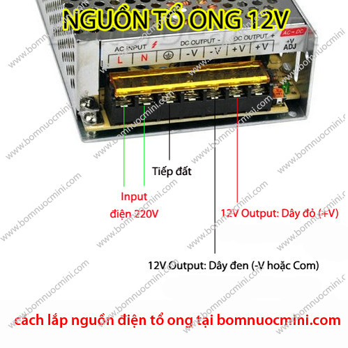

Cách đấu dây lấy nguồn từ nguồn tổ ong
#######################################

* **Thực hiện:** Thi Minh Nhựt - **Email:** thiminhnhut@gmail.com

* **Thời gian:** Ngày 16 tháng 03 năm 2018

Nội dung
========

* Đấu dây theo ký hiệu bên dưới:

+-------------------+-------------------------+---------+------+------+-------+-------+
| L                 | N                       | Ground  | V-   | V-   | V+    | V+    |
+===================+=========================+=========+======+======+=======+=======+
| Dây Line nguồn AC | Dây trung tính nguồn AC | Nối đất | 0VDC | 0VDC | 24VDC | 24VDC |
+-------------------+-------------------------+---------+------+------+-------+-------+

* Hình ảnh minh họa:

