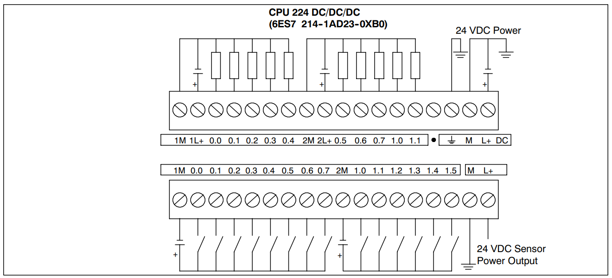

Sơ đồ đấu dây cấp nguồn cho PLC S7-200 loại CPU 224 (DC/DC/DC 214-1AD23-0XB0) hoạt động
#######################################################################################

* **Thực hiện:** Thi Minh Nhựt - **Email:** thiminhnhut@gmail.com

* **Thời gian:** Ngày 16 tháng 03 năm 2018

Nguồn tham khảo
***************

* `How to do connection of Siemens PLC (S7-200) Wiring? By Dhaka Industrial Automation <https://www.youtube.com/watch?v=h0vXG1gr-Ig>`_

Nội dung
********

* Đấu dây theo sơ đồ bên dưới:

* Các loại CPU khác thì xem cách đấu dây từ trang 390 đến trang 393 trong tài liệu hướng dẫn ``manual_s7_200_2005_en.pdf`` (trong mục `documents <https://github.com/thiminhnhut/PLC-S7-200-Tutorial/tree/master/documents>`_)
